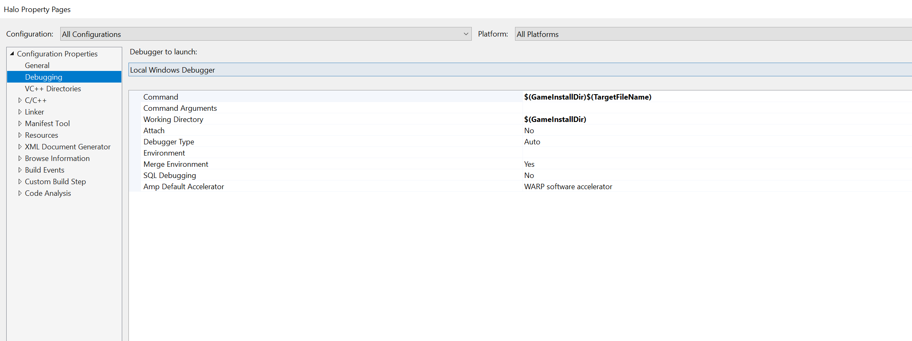
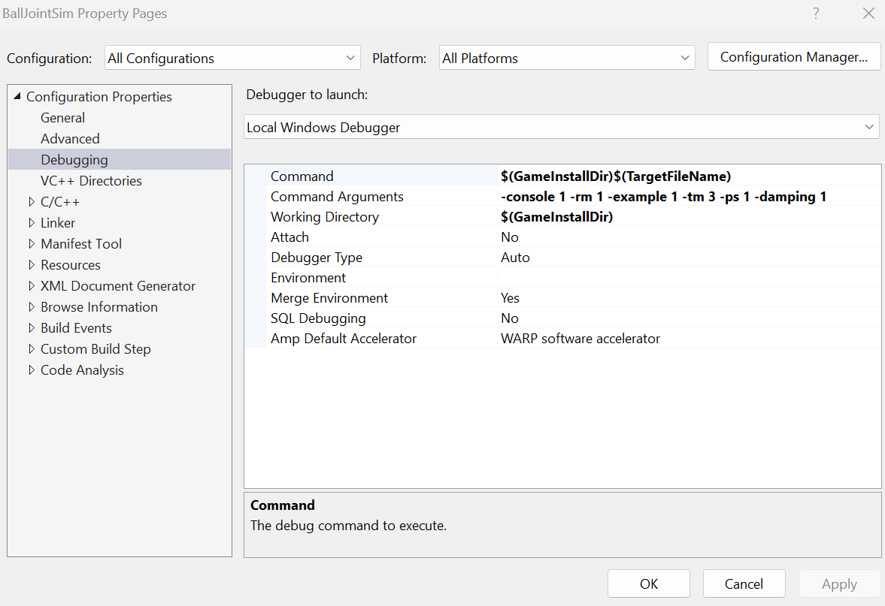
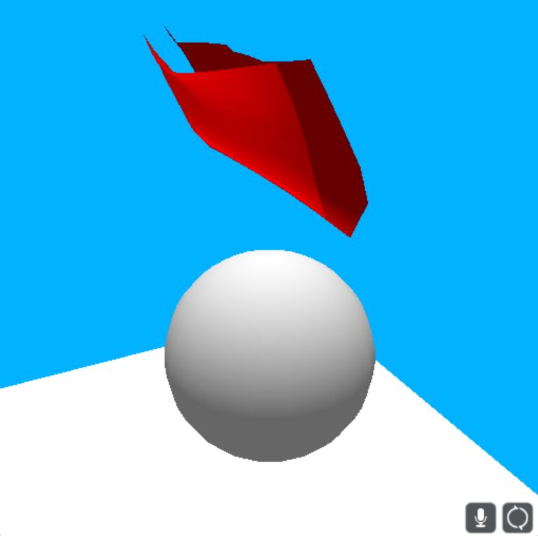
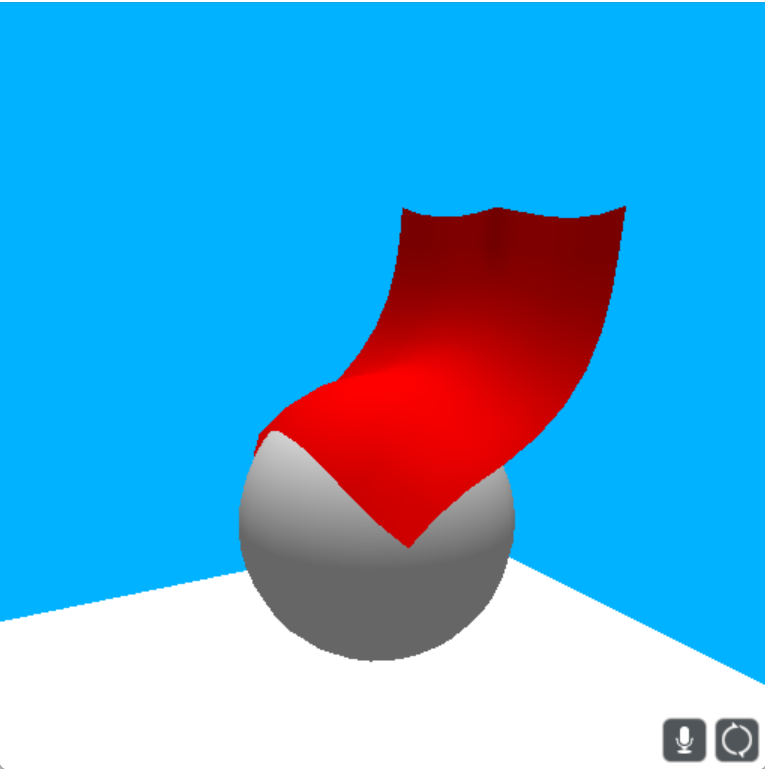
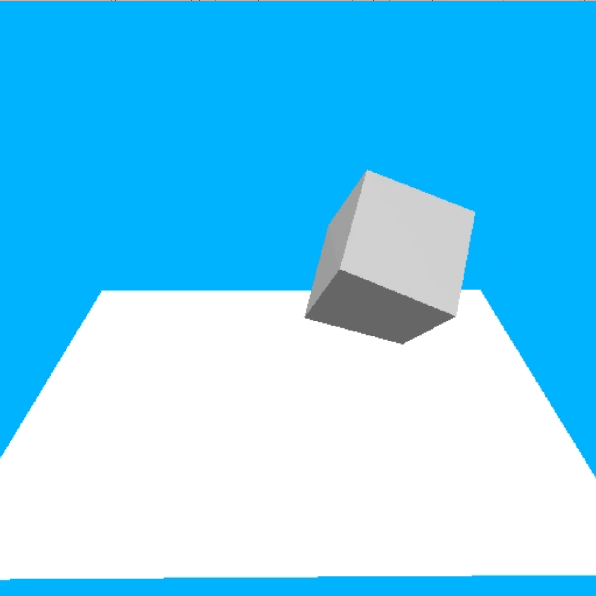
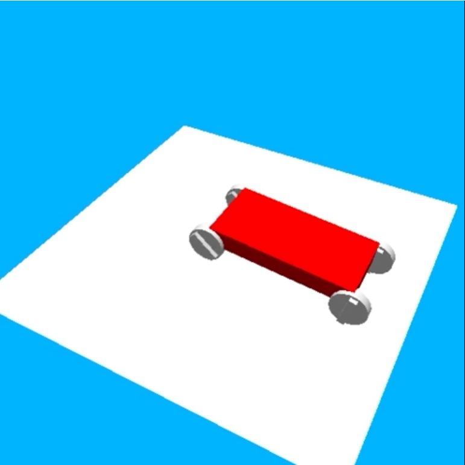
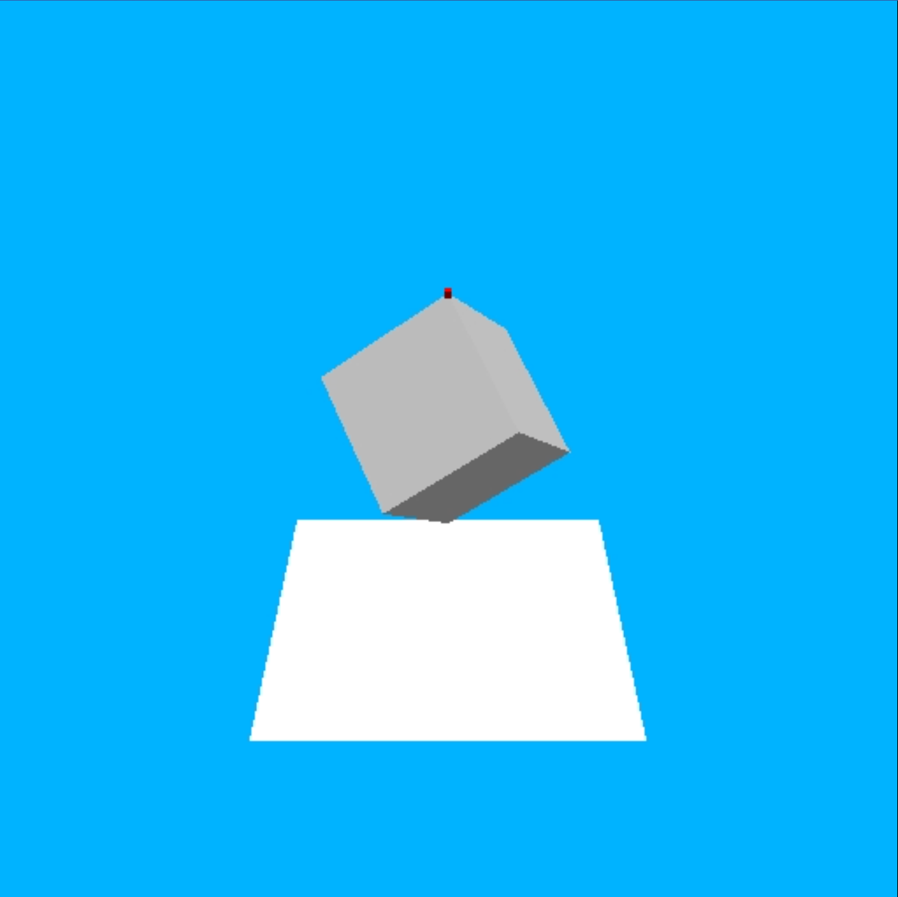
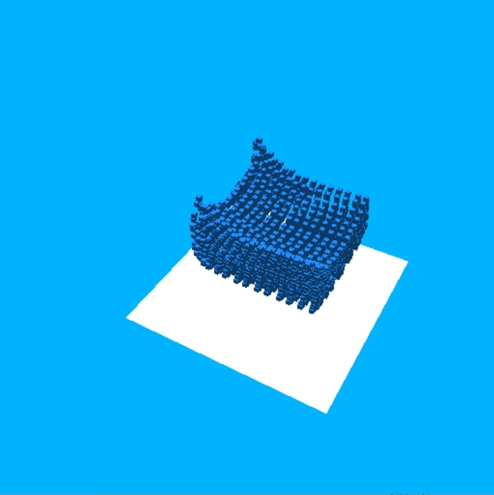

# Physicis Engine

## Instructions to Run
1. Open with Visual Studio 2017
2. Go to Solution Explorer, right click "Halo"
3. Select "Properties", choose "Debugging"
4. Enter "$(GameInstallDir)$(TargetFileName)" in "Command", enter "$(GameInstallDir)" in "Working Directory"
5. Now you can compile and run

6. Command arguments are explained down below.
-console
0: disable console terminal window
1: enable console terminal window
-rm (render mode)
0: rendering thread waits for logic thread to submit new data
1: rendering thread grabs whatever in the buffer submitted by logic thread
2: no rendering
-example
0 to 7: See function RunUnitTest() from HaloGame_\BallJointSim\MultiBodyUnitTest.cpp for all test cases.
-tm (twisting constraint mode)
0: direct swing twist
2: incremental
3: Euler twisting version two
-ps (position solve)
0: disable position solve
1: enable position solve

## Features
1. "HaloGame_\Halo\Custom Game Objects\Cloth.h" and its .cpp file implement cloth simulation with distance/bending constraint, self collision.
    
    
    

2. "HaloGame_\Halo\Custom Game Objects\JellyCube.h" implements elastic object simulation.
    
    

3. "HaloGame_\Halo\Custom Game Objects\Car.h" and its .cpp file implement car simulation by using constratint solver in maximum coordinate system.
    
    

4. "HaloGame_\Halo\Custom Game Objects\SphericalJoint.h" implments a spherical joint in reduced coordinate system.
    
    

5. "HaloGame_\Halo\Custom Game Objects\MPM.h" implements MPM.
    
    